<div align="center">
  <h1><a href="https://github.com/hhftechnology/crowdsec_manager">CrowdSec Manager</a></h1>

[](https://hub.docker.com/r/hhftechnology/crowdsec-manager)

[](https://discord.gg/HDCt9MjyMJ)


</div>

A web-based management interface for CrowdSec — decisions, alerts, allowlists, scenarios, hub, logs, backups, and Traefik integration.

## Mobile App

<div align="center">
<a href="https://apps.apple.com/us/app/#"></a>&nbsp;&nbsp;&nbsp;&nbsp;&nbsp;<a href="https://play.google.com/store/apps/details?id=com.crowdsec.manager.mobile"></a>&nbsp;&nbsp;&nbsp;&nbsp;&nbsp;<a href="https://play.google.com/store/apps/details?id=com.crowdsec.manager.independent"></a>
</div>

## Mobile Screenshots

<table>
  <tr>
    <td align="center">
      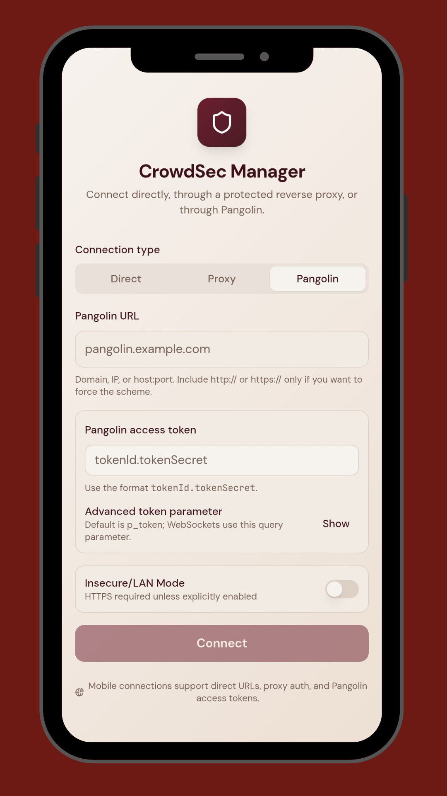<br>
      <sub>Connection Setup</sub>
    </td>
    <td align="center">
      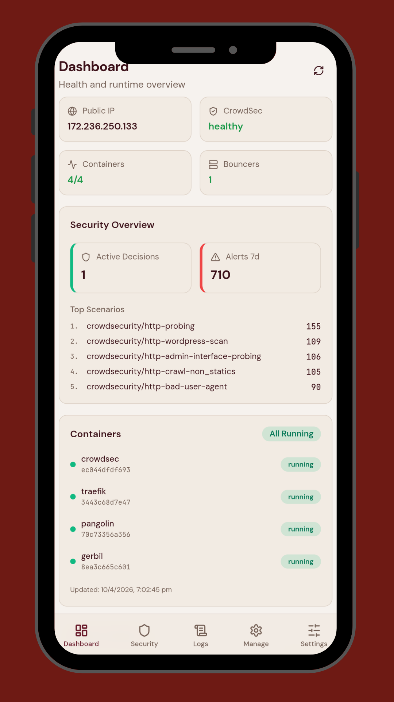<br>
      <sub>Dashboard Overview</sub>
    </td>
    <td align="center">
      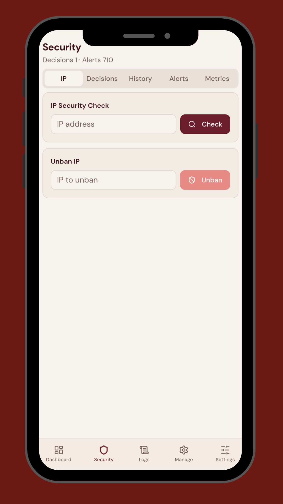<br>
      <sub>Security IP Check</sub>
    </td>
  </tr>
  <tr>
    <td align="center">
      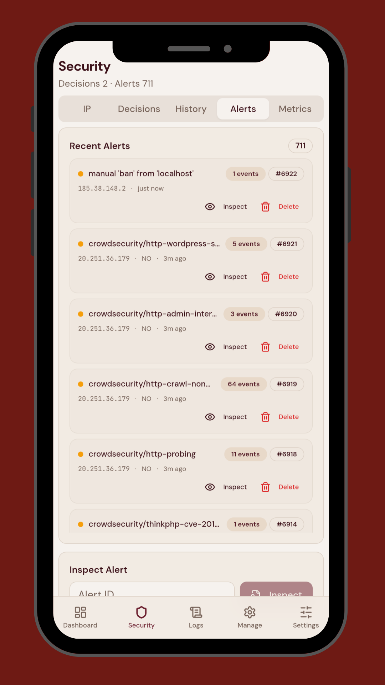<br>
      <sub>Security Alerts List</sub>
    </td>
    <td align="center">
      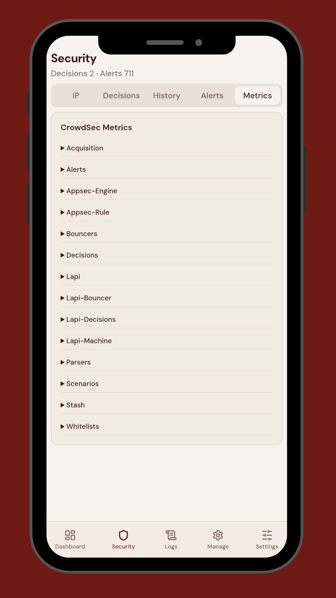<br>
      <sub>Security Metrics</sub>
    </td>
    <td align="center">
      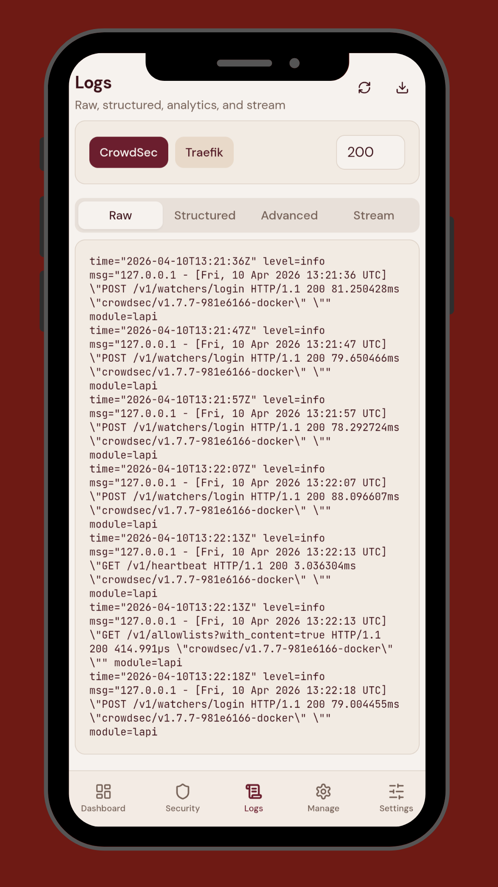<br>
      <sub>Logs Viewer</sub>
    </td>
  </tr>
  <tr>
    <td align="center">
      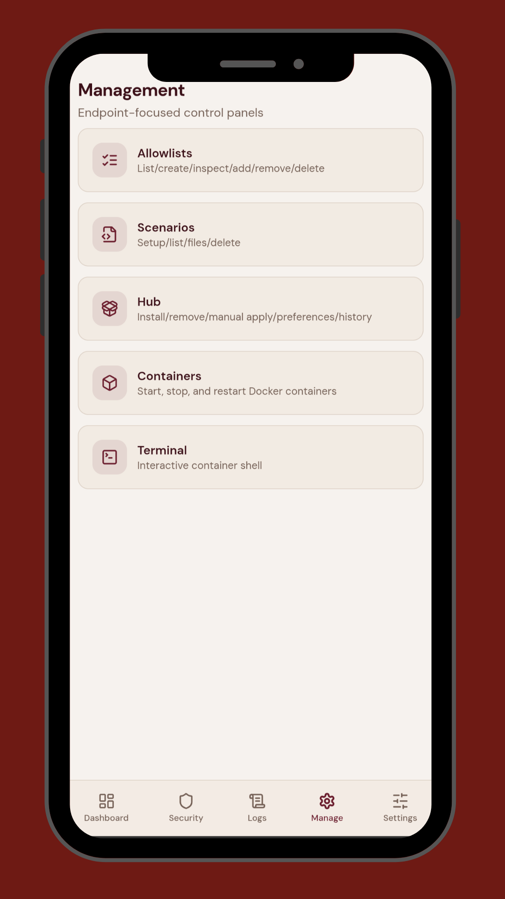<br>
      <sub>Management Home</sub>
    </td>
    <td align="center">
      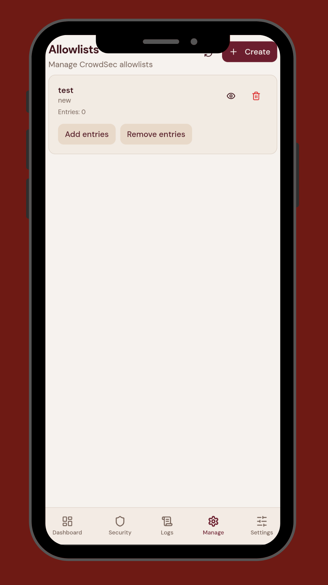<br>
      <sub>Allowlists Management</sub>
    </td>
    <td align="center">
      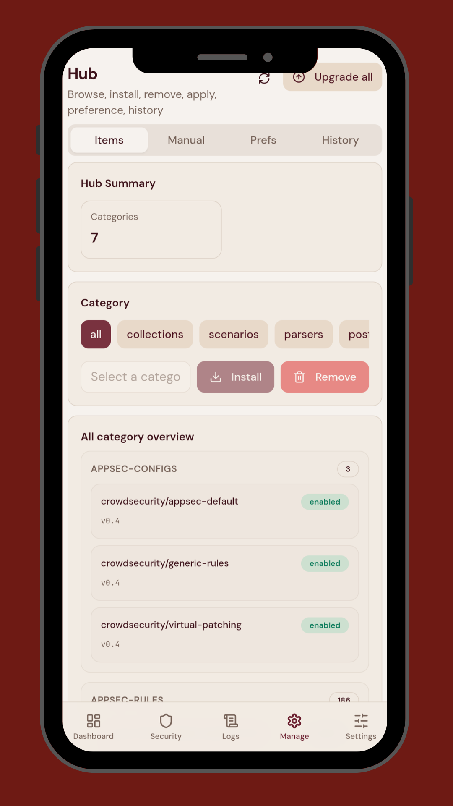<br>
      <sub>Hub Management</sub>
    </td>
  </tr>
  <tr>
    <td align="center">
      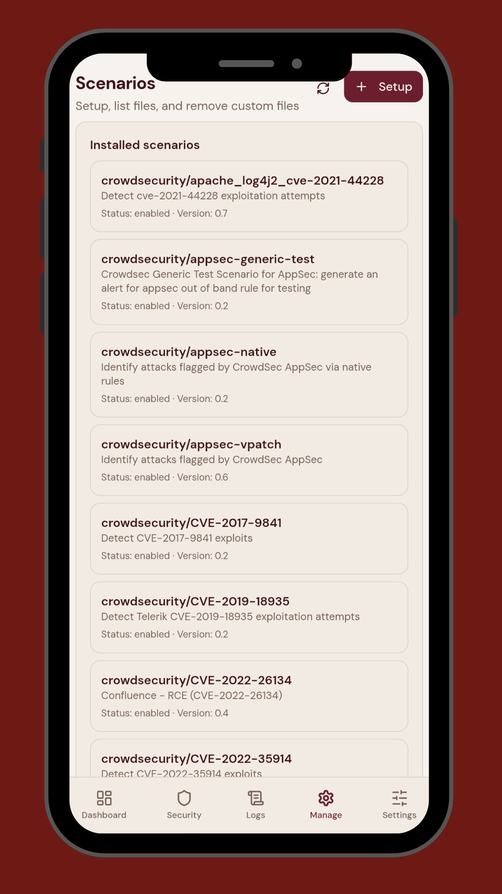<br>
      <sub>Scenarios Management</sub>
    </td>
    <td align="center">
      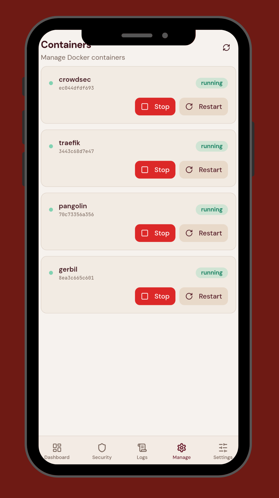<br>
      <sub>Container Controls</sub>
    </td>
    <td align="center">
      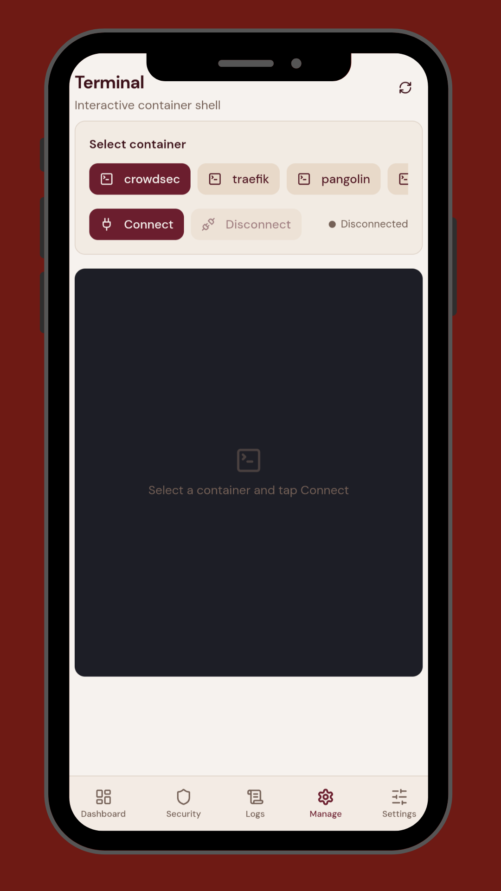<br>
      <sub>Terminal Shell</sub>
    </td>
  </tr>
</table>

Native iOS and Android app. Supports **Pangolin** (token-based remote access) and **Basis** (direct URL) connection modes.

## Release

- Version: `2.3.4`
- Pangolin image: `hhftechnology/crowdsec-manager:latest` — full stack with Traefik, Pangolin, Gerbil
- Independent image: `hhftechnology/crowdsec-manager:independent` — CrowdSec only, no Traefik
- Image size (linux/amd64): <!-- IMAGE_SIZE_START -->44MB<!-- IMAGE_SIZE_END -->

## Quick Start

### Pangolin (full stack)

```bash
git clone https://github.com/hhftechnology/crowdsec_manager.git
cd crowdsec_manager
mkdir -p ./config/crowdsec ./config/traefik ./backups ./logs/app ./logs/traefik ./data
docker compose up -d
```

### Independent (CrowdSec only)

```bash
mkdir -p ./config/crowdsec ./logs/app ./data
```

```yaml
services:
  crowdsec-manager:
    image: hhftechnology/crowdsec-manager:independent
    container_name: crowdsec-manager
    restart: unless-stopped
    ports:
      - "8080:8080"
    environment:
      - PORT=8080
      - ENVIRONMENT=production
      - CONFIG_DIR=/app/config
      - DATABASE_PATH=/app/data/settings.db
      - INCLUDE_CROWDSEC=true
    volumes:
      - /var/run/docker.sock:/var/run/docker.sock
      - ./config:/app/config
      - ./logs/app:/app/logs
      - ./data:/app/data
    networks:
      - crowdsec-network
    depends_on:
      - crowdsec

  crowdsec:
    image: crowdsecurity/crowdsec:latest
    container_name: crowdsec
    environment:
      - COLLECTIONS=crowdsecurity/linux
    volumes:
      - ./config/crowdsec/acquis.yaml:/etc/crowdsec/acquis.yaml:ro
      - crowdsec-db:/var/lib/crowdsec/data/
      - crowdsec-config:/etc/crowdsec/
    networks:
      - crowdsec-network

networks:
  crowdsec-network:
    driver: bridge

volumes:
  crowdsec-db:
  crowdsec-config:
```

```bash
docker compose up -d
curl http://localhost:8080/api/health/stack
```

## Screenshots


## Documentation

Full installation guide, configuration reference, mobile app setup, and API docs:
[crowdsec-manager.hhf.technology](https://crowdsec-manager.hhf.technology)

## License

MIT — see [LICENSE](LICENSE).

## Support

- [GitHub Issues](https://github.com/hhftechnology/crowdsec_manager/issues)
- [Discord](https://discord.gg/HDCt9MjyMJ)
